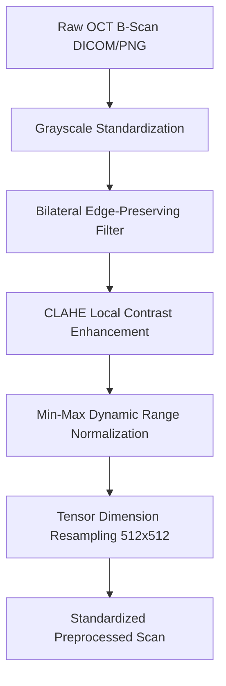

# 🔬 Image Processing & Deep Learning Algorithms Manual

This document details the scientific image processing, computer vision algorithms, and deep neural network architectures implemented in **RetinaSeg AI**.

---

## 1. 🖼️ Optical Preprocessing Pipeline

The preprocessing pipeline cleans raw OCT B-scans, suppresses optical speckle noise, and enhances inter-layer contrast prior to neural network inference.



### A. Grayscale Standardization
Converts raw RGB or multi-channel scans into an 8-bit single-channel luminance intensity matrix:
$$I_{\text{gray}} = 0.299 \cdot R + 0.587 \cdot G + 0.114 \cdot B$$

### B. Bilateral Edge-Preserving Speckle Filter
- **Parameters**: Diameter $d = 9$, $\sigma_{\text{color}} = 75$, $\sigma_{\text{space}} = 75$.
- **Mathematical Principle**: Combines geometric closeness and photometric similarity:
  $$I_{\text{filtered}}(p) = \frac{1}{W_p} \sum_{q \in \Omega} I(q) \cdot f(\|p - q\|) \cdot g(\|I(p) - I(q)\|)$$
- **Advantage**: Smooths destructive Rayleigh speckle noise in homogeneous retinal fluid while maintaining razor-sharp gradients at layer boundaries (e.g. ILM, IS/OS junction, RPE).

### C. CLAHE (Contrast Limited Adaptive Histogram Equalization)
- **Parameters**: Clip limit = $2.5$, Tile grid = $8 \times 8$.
- **Mathematical Principle**: Divides scan into contextual tiles, computes local histograms, clips peaks above $2.5$ to prevent over-amplification of background noise, and redistributes pixels using bilinear interpolation across tile borders.

### D. Min-Max Dynamic Range Normalization
Rescales intensity values strictly into $[0, 255]$:
$$I_{\text{norm}}(x, y) = \left( \frac{I(x, y) - \min(I)}{\max(I) - \min(I)} \right) \times 255$$

---

## 2. 🧠 AI Segmentation & Deep Learning Architecture

### A. Multi-Class U-Net Residual Architecture
- **Input Tensor**: $(1, 512, 512, 1)$
- **Output Tensor**: $(1, 512, 512, 9)$ (8 Retinal Layers + 1 Background)

```
Input Image (512x512)
   │
   ▼
[Conv 3x3 + BN + ReLU x2] ─── (Skip Connection) ───────────► [Up-Conv 2x2 + Concat + Conv x2]
   │ (Max-Pool 2x2)                                              ▲
   ▼                                                             │
[Conv 3x3 + BN + ReLU x2] ─── (Skip Connection) ───────────► [Up-Conv 2x2 + Concat + Conv x2]
   │ (Max-Pool 2x2)                                              ▲
   ▼                                                             │
[Conv 3x3 + BN + ReLU x2] ─── (Skip Connection) ───────────► [Up-Conv 2x2 + Concat + Conv x2]
   │ (Max-Pool 2x2)                                              ▲
   ▼                                                             │
[Conv 3x3 + BN + ReLU x2] ─── (Skip Connection) ───────────► [Up-Conv 2x2 + Concat + Conv x2]
   │ (Max-Pool 2x2)                                              ▲
   ▼                                                             │
[Bottleneck: Residual Conv 512 Filters] ─────────────────────────┘
                                                                 │
                                                                 ▼
                                                  [1x1 Conv + Softmax Activation]
                                                                 │
                                                                 ▼
                                                   8-Layer Pixel Probability Map
```

### B. Topological Layer Ordering & Monotonicity
RetinaSeg enforces anatomical stratification from anterior to posterior retina:
$$\text{ILM} \prec \text{RNFL} \prec \text{GCL} \prec \text{IPL} \prec \text{INL} \prec \text{OPL} \prec \text{ONL} \prec \text{RPE}$$

### C. Contour & Compositing Algorithms
- **Vector Contour Extraction**: Utilizes the **Suzuki-Abe Border Following Algorithm** (`cv2.findContours`) to generate continuous mathematical boundary splines.
- **Overlay Alpha Blending**:
  $$I_{\text{overlay}} = 0.45 \cdot I_{\text{original}} + 0.55 \cdot I_{\text{mask}}$$

---

## 3. 🎨 The 8 Retinal Anatomical Sub-Layers

| Index | Code | Layer Name | Anatomical Significance | Color Code | Hex Code |
|---|---|---|---|---|---|
| 1 | **ILM** | Internal Limiting Membrane | Vitreoretinal boundary interface | 🔴 Crimson | `#FF1744` |
| 2 | **RNFL** | Retinal Nerve Fiber Layer | Unmyelinated retinal ganglion axons (Glaucoma marker) | 🟠 Amber | `#FF9100` |
| 3 | **GCL** | Ganglion Cell Layer | Cell bodies of retinal ganglion neurons | 🟡 Gold | `#FFEA00` |
| 4 | **IPL** | Inner Plexiform Layer | Synapses between bipolar and ganglion cells | 🟢 Mint Green | `#00E676` |
| 5 | **INL** | Inner Nuclear Layer | Cell bodies of horizontal, bipolar, and amacrine cells | 🔵 Sky Blue | `#00B0FF` |
| 6 | **OPL** | Outer Plexiform Layer | Synapses between photoreceptors and bipolar cells | 🟣 Indigo | `#651FFF` |
| 7 | **ONL** | Outer Nuclear Layer | Photoreceptor cell bodies (Rods and Cones) | 🟪 Violet | `#D500F9` |
| 8 | **RPE** | Retinal Pigment Epithelium | Support layer & blood-retinal barrier (AMD marker) | 🌺 Magenta | `#F50057` |

---

## 4. 📏 Quantitative Clinical Metric Formulations

### A. Retinal Thickness Calibration
For each column / A-scan $x$, thickness in pixels is:
$$t_{\text{px}}(x) = y_{\text{bottom}}(x) - y_{\text{top}}(x)$$

Using the axial calibration factor ($c = 3.87\,\mu\text{m/pixel}$):
$$t_{\mu\text{m}}(x) = t_{\text{px}}(x) \times c$$

- **Mean Thickness**: $\bar{T} = \frac{1}{N} \sum_{x=1}^{N} t_{\mu\text{m}}(x)$
- **Min Thickness**: $T_{\min} = \min_{x} t_{\mu\text{m}}(x)$
- **Max Thickness**: $T_{\max} = \max_{x} t_{\mu\text{m}}(x)$
- **Layer Area**: $A = \sum_{x=1}^{N} t_{\text{px}}(x) \text{ px}^2$

### B. Signal-to-Noise Ratio (SNR) Improvement
$$\Delta\text{SNR}_{\text{dB}} = 10 \log_{10}\left( \frac{\mu_{\text{proc}} / \sigma_{\text{proc}}}{\mu_{\text{orig}} / \sigma_{\text{orig}}} + 1 \right)$$
