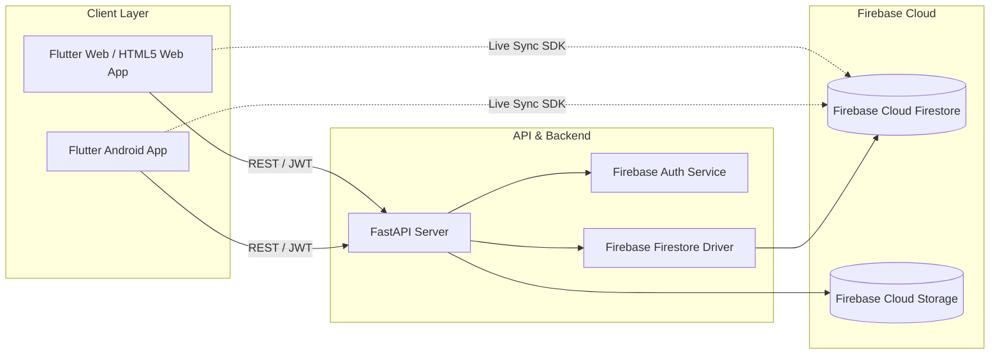

# 🗄️ Database Architecture & Storage Specification

This document details the **pure Google Firebase Cloud Firestore** architecture, collections, and document schemas powering **RetinaSeg AI**. All legacy PostgreSQL / SQLite relational models have been completely removed.

---

## 1. 🏗️ High-Level Pure Firebase Architecture

RetinaSeg AI uses **Google Firebase Cloud Firestore** (`oct-medical-application`) as the sole primary database:



---

## 2. ☁️ Google Firebase Cloud Firestore Collections

- **Firebase Project ID**: `oct-medical-application`
- **Database Type**: Cloud NoSQL Document Store

### Collections & Document Schemas:

#### A. `users/{userId}`
Stores registered clinician profiles, credentials, and roles.
```json
{
  "id": "usr_7f8a12bc90",
  "email": "doctor@hospital.org",
  "full_name": "Dr. Sarah Reynolds, MD",
  "role": "OPHTHALMOLOGIST",
  "specialty": "Vitreoretinal Specialist",
  "license_number": "OPH-98421",
  "is_active": true,
  "created_at": "2026-08-30T10:00:00Z",
  "last_login": "2026-08-30T10:30:00Z"
}
```

#### B. `patients/{patientId}`
Stores patient demographics, medical history, and clinical indications.
```json
{
  "id": "pat_d4e819ac",
  "patient_id": "PAT-2026-0042",
  "full_name": "Eleanor Vance",
  "age": 64,
  "gender": "Female",
  "eye_condition": "Suspected Diabetic Macular Edema (OD)",
  "created_by": "doctor@hospital.org",
  "created_by_id": "usr_7f8a12bc90",
  "date_registered": "2026-08-30T10:05:00Z",
  "created_at": "2026-08-30T10:05:00Z"
}
```

#### C. `oct_scans/{scanId}`
Stores raw B-scan metadata, pixel dimensions, axial calibration, and storage references.
```json
{
  "id": "scn_9a2b3c4d",
  "scan_uid": "OCT-7F4B9210",
  "patient_id": "pat_d4e819ac",
  "patient_name": "Eleanor Vance",
  "eye_laterality": "OD",
  "device_manufacturer": "Heidelberg Spectralis OCT",
  "axial_resolution_um": 3.87,
  "file_url": "/api/static/uploads/OCT-7F4B9210_scan.png",
  "uploaded_by": "doctor@hospital.org",
  "uploaded_by_id": "usr_7f8a12bc90",
  "validation_status": "VALID",
  "validation_score": 0.96,
  "created_at": "2026-08-30T10:10:00Z"
}
```

#### D. `analysis_results/{analysisId}`
Stores 8-layer U-Net segmentation outputs, thickness metrics, and mask/overlay URLs.
```json
{
  "id": "ana_5f6e7d8c",
  "scan_id": "scn_9a2b3c4d",
  "scan_uid": "OCT-7F4B9210",
  "patient_id": "pat_d4e819ac",
  "patient_name": "Eleanor Vance",
  "model_version": "RetinaUNet-v1.4.2-MultiLayer",
  "status": "COMPLETED",
  "confidence_score": 0.942,
  "overall_quality": "Good",
  "layer_metrics": [
    { "layer_name": "ILM", "layer_index": 1, "is_detected": true, "mean_thickness_um": 12.4, "layer_area_px": 1910 },
    { "layer_name": "RNFL", "layer_index": 2, "is_detected": true, "mean_thickness_um": 38.7, "layer_area_px": 5970 },
    { "layer_name": "GCL", "layer_index": 3, "is_detected": true, "mean_thickness_um": 33.4, "layer_area_px": 5154 },
    { "layer_name": "IPL", "layer_index": 4, "is_detected": true, "mean_thickness_um": 35.8, "layer_area_px": 5520 },
    { "layer_name": "INL", "layer_index": 5, "is_detected": true, "mean_thickness_um": 33.2, "layer_area_px": 5126 },
    { "layer_name": "OPL", "layer_index": 6, "is_detected": true, "mean_thickness_um": 30.3, "layer_area_px": 4672 },
    { "layer_name": "ONL", "layer_index": 7, "is_detected": true, "mean_thickness_um": 55.4, "layer_area_px": 8542 },
    { "layer_name": "RPE", "layer_index": 8, "is_detected": true, "mean_thickness_um": 37.5, "layer_area_px": 5785 }
  ],
  "mask_url": "/api/static/masks/mask_sample.png",
  "overlay_url": "/api/static/overlays/overlay_sample.png",
  "analyzed_by": "doctor@hospital.org",
  "analyzed_by_id": "usr_7f8a12bc90",
  "created_at": "2026-08-30T10:12:00Z"
}
```

#### E. `reports/{reportId}`
Stores generated diagnostic PDF reports, specialist notes, and download links.
```json
{
  "id": "rep_1a2b3c4d",
  "report_uid": "REP-A7DC5C1B",
  "analysis_id": "ana_5f6e7d8c",
  "patient_id": "pat_d4e819ac",
  "patient_name": "Eleanor Vance",
  "pdf_path": "storage/reports/report_REP-A7DC5C1B.pdf",
  "pdf_url": "/api/reports/download/rep_1a2b3c4d",
  "doctor_name": "Dr. Sarah Reynolds, MD",
  "clinical_notes": "Clinical U-Net retinal layer segmentation verified. Intact ILM, RNFL, and RPE boundaries.",
  "findings_summary": "Automated segmentation successfully identified all 8 retinal sub-layers with high anatomical continuity.",
  "generated_by": "doctor@hospital.org",
  "generated_by_id": "usr_7f8a12bc90",
  "created_at": "2026-08-30T10:15:00Z"
}
```

#### F. `audit_logs/{auditId}`
Regulatory audit events logged for every clinical creation, analysis, and report export.

---

## 3. 🛡️ User Data Isolation in Firestore

In Firestore, document security and multi-clinician data isolation are enforced directly by query filters on `created_by` / `created_by_id` / `uploaded_by` / `analyzed_by`:
1. **Fresh Dashboard for New Users**:
   - `GET /api/dashboard/stats` queries Firestore collections filtered by the active user's identifier.
   - For any newly registered clinician, count queries return **`0` Patients**, **`0` Scans**, **`0` Analyses**, **`0` Reports**.
2. **Cross-User Protection**:
   - A clinician can only list, view, update, or delete records where `created_by == current_user.email` or `created_by_id == current_user.id`.
