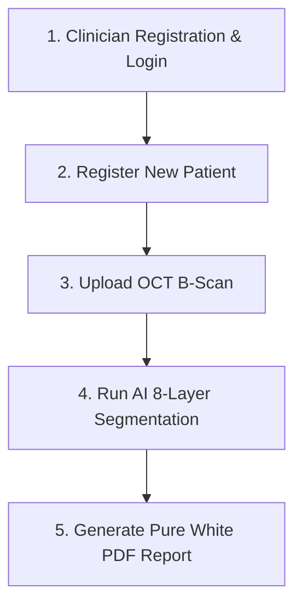

# 🏥 Clinical User Manual & End-to-End Workflow

This document provides a step-by-step operational guide for clinicians and researchers using the **RetinaSeg AI** platform.

---

## 🔄 The 5-Step Clinical Workflow

---

### Step 1: Clinician Registration & Authentication
1. Open the application at **`http://127.0.0.1:8000/`**.
2. Click **Get Started** or **Register**.
3. Enter your Full Name, Email (`doctor.yourname@hospital.org`), Role (Ophthalmologist/Doctor), and Password ($\ge 6$ characters).
4. Click **Create Account**.
5. The system hashes your password using **bcrypt**, issues a signed JWT token, and immediately directs you to your **Fresh Dashboard** with all statistics starting at `0`.

---

### Step 2: Patient Registration
1. Navigate to **Patient Management** from the sidebar.
2. Click **Register New Patient**.
3. Fill in Patient ID / MRN, Full Name, Age, Gender, and Eye Condition / Clinical Indication.
4. Click **Save Patient Record**. The dashboard stat for Total Patients increments to `1`.

---

### Step 3: OCT B-Scan Acquisition & Upload
1. Navigate to **Upload OCT Scan**.
2. Select the registered patient.
3. Choose Eye Laterality (**OD** - Right Eye or **OS** - Left Eye).
4. Select the Acquisition Device (**Heidelberg Spectralis OCT**, **Zeiss Cirrus**, **Topcon 3D OCT**).
5. Drag and drop or upload the raw OCT B-scan image (`.png`, `.dcm`, `.tif`).
6. Click **Upload & Process Scan**.

---

### Step 4: Run AI Segmentation Workspace
1. In the **AI Segmentation Workspace**, click **Run AI Layer Segmentation**.
2. The pipeline automatically executes:
   - Bilateral speckle filtering ($d=9, \sigma=75$)
   - CLAHE local contrast enhancement
   - U-Net 4-Depth Residual deep neural network inference
3. Inspect the real-time **4-Panel Quad View**:
   - **Original OCT B-Scan**
   - **CLAHE Contrast Enhanced Image**
   - **8-Layer Segmentation Color Mask**
   - **Layer Boundary Vector Contour Overlay**
4. Review the **Quantitative Layer Thickness Metrics Table** (Mean, Min, Max thickness in $\mu\text{m}$ calibrated at $3.87\,\mu\text{m/px}$).

---

### Step 5: Pure White Clinical Report & PDF Export
1. Click **Generate Diagnostic Report**.
2. Enter any custom specialist observations or clinical notes.
3. Click **Preview Report**.
4. The system opens the **Clinical Diagnostic Report Preview** rendered on a **pure white medical paper background** (`#ffffff`).
5. Click **Download PDF** to export the standardized report for clinical records, or click **Print** to send directly to a clinic printer.
